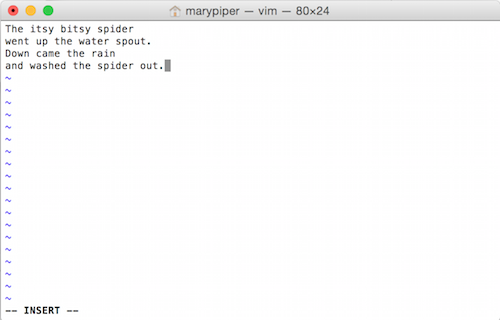

Approximate time: 30 min

## Learning Objectives

* Learn basic operations using the Vim text editor

## Writing files

We've been able to do a lot of work with files that already exist, but what if we want to write our own files. Obviously, we're not going to type in a FASTA file, but you'll see as we go through other tutorials, there are a lot of reasons we'll want to write/create a file or edit an existing file.

To write in files, we're going to use a text editor called `vim`.

### Introduction to Vim 

Vim is a very powerful text editor, and it offers extensive text editing options. However, in this introduction we are going to focus on exploring some of the basic functions. There is a lot of functionality that we are not going to cover during this session, but encourage you to go further as you become more comfortable using it. To help you remember some of the keyboard shortcuts that are introduced below and to allow you to explore additional functionality on your own, we have compiled a [cheatsheet](./VI_CommandReference.pdf).

> ### Which Editor?
> 
> When we say, "`vim` is a text editor," we really do mean "text": it can
> only work with plain character data, not tables, images, or any other
> media. While there are simpler editors available for use (i.e. [nano](http://www.nano-editor.org/), most computational scientists tend to favor editors that have greater functionality. 
> Some popular editors include [Emacs](http://www.gnu.org/software/emacs/),
> [Vim](http://www.vim.org/), or a graphical editor such as
> [Gedit](http://projects.gnome.org/gedit/). These are editors which are generally available for use on 
> high-performance compute clusters.

You can create a file in Unix using the `touch` command, but you can also create a document by calling a text editor and providing the name of the document you wish to create. To create a document using vim entitled `draft.txt`, let's type in the terminal:

	vim draft.txt

### Vim Interface
Notice the `"draft.txt" [New File]` typed at the bottom left-hand section of the screen. This tells you that you just created a new file in vim. 

### Vim Modes
Vim has **_two basic modes_** that will allow you to create documents and edit your text:   

- **_command mode (default mode):_** will allow you to save and quit the program (and execute other more advanced commands).  

- **_insert (or edit) mode:_** will allow you to write and edit text

Upon creation of a file, vim is automatically in command mode. Let's _change to insert mode_ by typing `i`. Notice the `--INSERT--` at the bottom left hand of the screen. Now type in a few lines of text:

After you have finished typing, press `esc` to enter command mode. Notice the `--INSERT--` disappeared from the bottom of the screen.

 

#### Vim Saving and Quitting
To **write to file (save)**, type `:w`. You can see the commands you type in the bottom left-hand corner of the screen. 

After you have saved the file, the total number of lines and characters in the file will print out at the bottom left-hand section of the screen.

Alternatively, we can **write to file (save) and quit**. Let's do that by typing `:wq`. Now, you should have exited vim and returned back to your terminal window.

To edit your `draft.txt` document, open up the file again by calling vim and entering the file name: `vim draft.txt`. Change to insert mode and type a few more lines (you can move around the lines using the arrows on the keyboard). This time we decide to **quit without saving** by typing `:q!`
 

### Vim Editing
Create the document "spider.txt" in vim. Enter the text as follows: 

To make it easier to refer to distinct lines, we can add line numbers by typing `:set number`. **Save the document.** Later, if you choose to remove the line numbers you can type `:set nonumber`.

While we cannot point and click to navigate the document, we can use the arrow keys to move around. Navigating with arrow keys can be very slow, so Vim has shortcuts (which are completely unituitive, but very useful as you get used to them over time). Check to see what mode you are currently in. While in command mode, try moving around the screen and familarizing yourself with some of these shortcuts:    

	`gg`: move to top of file  
	`G`: move to bottom of file  
	`0`: move to beginning of line  
	`$`: move to end of line  
	`w`: move to next word
	`b`: move to previous word

In addition to shortcuts for navigation, vim also offers editing shortcuts such as:

	`dw`: delete word 
	`dd`: delete line  
	`u`: undo
	`Ctrl + r`: redo
	
Practice some of the editing shortcuts, then quit the document without saving any changes.

*** 

**Exercise**

We have covered some basic commands in vim, but practice is key for getting comfortable with the program. Let's
practice what we just learned in a brief challenge.

1. Open spider.txt, and delete the word "water" from line #2.
2. Quit without saving.
3. Open `spider.txt` again, and delete: "Down came the rain." 
4. Save the file.
5. Undo your previous deletion.
6. Redo your previous deletion.
7. Delete the first and last words from each of the lines.
8. Save the file and see whether your results match your neighbors.

***

---

*This lesson has been developed by members of the teaching team at the [Harvard Chan Bioinformatics Core (HBC)](http://bioinformatics.sph.harvard.edu/). These are open access materials distributed under the terms of the [Creative Commons Attribution license](https://creativecommons.org/licenses/by/4.0/) (CC BY 4.0), which permits unrestricted use, distribution, and reproduction in any medium, provided the original author and source are credited.*
