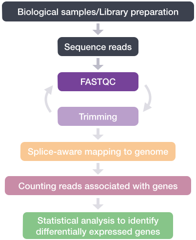
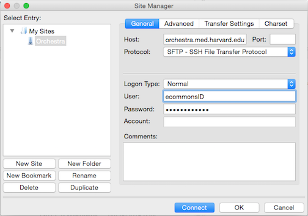

Approximate time: 60 minutes

## Learning Objectives:

* Learn the intricacies of various tools used in NGS analysis (parameters, usage, etc)
* Be able to evaluate a FastQC report
* Use a `for` loop to automate operations on multiple files


##Quality Control of FASTQ files
Assessing the quality of your data and performing any necessary quality control measures, such as trimming, is a critical first step in the analysis of your RNA-Seq data. 





### FastQC
Now that we know about what information is stored in a FASTQ file, the next step is to assess that information to see if the data contained within are of good quality.

FastQC (http://www.bioinformatics.babraham.ac.uk/projects/fastqc/) provides a simple way to do some quality control checks on raw sequence data coming from high throughput sequencing pipelines. It provides a modular set of analyses which you can use to give a quick impression of whether your data has any problems of which you should be aware before doing any further analysis.

The main functions of FastQC are:

* Import of data from BAM, SAM or FastQ files (any variant)
* Providing a quick overview to tell you in which areas there may be problems
* Summary graphs and tables to quickly assess your data
* Export of results to an HTML based permanent report
* Offline operation to allow automated generation of reports without running the interactive application


### Running FASTQC
####A. Stage your data

To perform our quality checks, we will be working within our recently created `rnaseq_project` directory. We need to create two directories within the `data` directory for this quality control step. 

`$ cd unix_oct2015/rnaseq_project/data`

`$ mkdir untrimmed_fastq`

`$ mkdir trimmed_fastq`
    
The raw_fastq data we will be working with is currently in the `unix_oct2015/raw_fastq` directory. We need to copy the raw fastq files to our `untrimmed_fastq` directory:

`$ cp -r ~/unix_oct2015/raw_fastq/*fq  ~/unix_oct2015/rnaseq_project/data/untrimmed_fastq`

####B. Run FastQC  

Before we run FastQC, let's start an interactive session on the cluster:

`$ bsub -Is -n 1 -q interactive bash`

***An interactive session is a very useful to test tools, workflows, run jobs that open new interactive windows (X11-forwarding) and so on.***

Once your interactive job starts, notice that the command prompt has changed; this is because we are working on a compute node now, not on a login node.

`$ cd ~/unix_oct2015/rnaseq_project/data/untrimmed_fastq/`  

Before we start using software, we have to load the environments for each software package. On clusters, this is typically done using a **module** system. 

If we check which modules we currently have loaded, we should not see FastQC.

`$ module list`

If we try to run FastQC on one of our fastq files, Orchestra won't be able to find the program.

`$ fastqc Mov10_oe_1.subset.fq`

This is because the FastQC program is not in our $PATH (i.e. its not in a directory that unix will automatically check to run commands/programs).

`$ $PATH`

To run the FastQC program, we first need to load the appropriate module, so it puts the program into our path:

`$ module load seq/fastqc/0.11.3`

Once a module for a tool is loaded, you have essentially made it directly available to you like any other basic UNIX command.

`$ module list`

`$ $PATH`

FastQC will accept multiple file names as input, so we can use the *.fq wildcard.

`$ fastqc *.fq`

*Did you notice how each file was processed serially? How do we speed this up?*

Exit the interactive session and start a new one with 6 cores, and use the multi-threading funcionality of FastQC to run 6 jobs at once.

`$ exit`      #exit the current interactive session
	
`$ bsub -Is -n 6 -q interactive bash`      #start a new one with 6 cpus (-n 6)
	
`$ module load seq/fastqc/0.11.3`     #you'll have to reload the module for the new session
	
`$ fastqc -t 6 *.fq`      #note the extra parameter we specified for 6 threads

How did I know about the -t argument for FastQC?

`$ fastqc -help`


Now, let's create a home for our results

`$ mkdir ~/unix_oct2015/rnaseq_project/results/fastqc_untrimmed_reads`

...and move them there (recall, we are still in `~/unix_oct2015/rnaseq_project/data/untrimmed_fastq/`)

`$ mv *.zip ~/unix_oct2015/rnaseq_project/results/fastqc_untrimmed_reads/`

`$ mv *.html ~/unix_oct2015/rnaseq_project/results/fastqc_untrimmed_reads/`

####C. Results
   
Let's take a closer look at the files generated by FastQC:
   
`$ ls -lh ~/unix_oct2015/rnaseq_project/results/fastqc_untrimmed_reads/`

##### HTML reports
The .html files contain the final reports generated by fastqc, let's take a closer look at them. Transfer one of them over to your laptop via *FileZilla*.

######Filezilla - Step 1

Open *FileZilla*, and click on the File tab. Choose 'Site Manager'.
 


######Filezilla - Step 2

Within the 'Site Manager' window, do the following: 

1. Click on 'New Site', and name it something intuitive (e.g. Orchestra)
2. Host: orchestra.med.harvard.edu 
3. Protocol: SFTP - SSH File Transfer Protocol
4. Logon Type: Normal
5. User: ECommons ID
6. Password: ECommons password
7. Click 'Connect'
	



	
***FastQC is just an indicator of what's going on with your data, don't take the "PASS"es and "FAIL"s too seriously.***

FastQC has a really well documented [manual page](http://www.bioinformatics.babraham.ac.uk/projects/fastqc/) with [more details](http://www.bioinformatics.babraham.ac.uk/projects/fastqc/Help/) about all the plots in the report.

We recommend looking at [this post](http://bioinfo-core.org/index.php/9th_Discussion-28_October_2010) for more information on what bad plots look like and what they mean for your data.

We will focus on two of the most important analysis modules in FastQC, the "Per base sequence quality" plot and the "Overrepresented sequences" table. 

The "Per base sequence quality" plot provides the distribution of quality scores across all bases at each position in the reads.


The "Overrepresented sequences" table displays the sequences (at least 20 bp) that occur in more than 0.1% of the total number of sequences. This table aids in identifying contamination, such as vector or adapter sequences. 


##### .zip files   

Let's go back to the terminal now. The other output of FastQC is a .zip file. These .zip files need to be unpacked with the `unzip` program. If we try to `unzip` them all at once:

`$ cd ~/unix_oct2015/rnaseq_project/results/fastqc_untrimmed_reads/`
    
`$ unzip *.zip`

Did it work? 

No, because `unzip` expects to get only one zip file. Welcome to the real world.
We *could* do each file, one by one, but what if we have 500 files? There is a smarter way.
We can save time by using a simple shell `for loop` to iterate through the list of files in *.zip.

After you type the first line, you will get a special '>' prompt to type next lines.  
You start with 'do', then enter your commands, then end with 'done' to execute the loop.

Note that in the first line, we create a variable named `zip`.  After that, we call that variable with the syntax `$zip`. `$zip` is assigned the value of each item (file) in the list *.zip, once for each iteration of the loop.

This loop is basically a simple program. When it runs

```bash
$ for zip in *.zip
> do
> unzip $zip
> done
```
it will run unzip once for each file (whose name is stored in the $zip variable). The contents of each file will be unpacked into a separate directory by the unzip program.

The 'for loop' is interpreted as a multipart command.  If you press the up arrow on your keyboard to recall the command, it will be shown like so:

    for zip in *.zip; do echo File $zip; unzip $zip; done

When you check your history later, it will help you remember what you did!

##### Document your work

What information is contained in the unzipped folder?

`$ ls -lh *fastqc`

`$ head *fastqc/summary.txt`

To save a record, let's `cat` all `fastqc summary.txt` files into one `full_report.txt` and move this to `~/unix_oct2015/rnaseq_project/docs`. 
You can use wildcards in paths as well as file names.  Do you remember how we said `cat` is really meant for concatenating text files?
    
`$ cat */summary.txt > ~/unix_oct2015/rnaseq_project/docs/fastqc_summaries.txt`


---
*The materials used in this lesson was derived from work that is Copyright © Data Carpentry (http://datacarpentry.org/). 
All Data Carpentry instructional material is made available under the [Creative Commons Attribution license](https://creativecommons.org/licenses/by/4.0/) (CC BY 4.0).*
