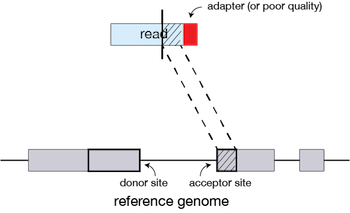
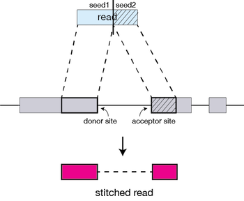

Approximate time:

## Learning Objectives:

* Understanding the alignment method STAR utilizes to align sequence reads to the reference genome
* Identifying the intricacies of alignment tools used in NGS analysis (parameters, usage, etc)
* Choosing appropriate STAR alignment parameters for our dataset
* Running STAR on multiple samples

## Read Alignment

The alignment process consists of choosing an appropriate reference genome to map our reads against and performing the read alignment using one of several splice-aware alignment tools such as [STAR](http://bioinformatics.oxfordjournals.org/content/early/2012/10/25/bioinformatics.bts635) or [TopHat2](https://ccb.jhu.edu/software/tophat/index.shtml). The choice of aligner is a personal preference and also dependent on the computational resources that are available to you.

## STAR Aligner

To determine where on the human genome our reads originated from, we will align our reads to the reference genome using [STAR](http://www.ncbi.nlm.nih.gov/pmc/articles/PMC3530905/) (Spliced Transcripts Alignment to a Reference). STAR is an aligner designed to specifically address many of the challenges of RNA-seq data mapping using a novel strategy for spliced alignments. 

### STAR Alignment Strategy

STAR is shown to have high accuracy and outperforms other aligners by more than a factor of 50 in mapping speed (but also requires quite a bit of memory). The algorithm achieves this highly efficient mapping by performing a two-step process:

1. Seed searching
2. Clustering, stitching, and scoring

#### Seed searching

For every read that STAR aligns, STAR will search for the longest sequence that exactly matches one or more locations on the reference genome. These longest matching sequences are called the Maximal Mappable Prefixes (MMPs):


	
The different parts of the read that are mapped separately are called 'seeds'. So the first MMP that is mapped to the genome is called *seed1*.

STAR will then search again for only the unmapped portion of the read to find the next longest sequence that exactly matches the reference genome, or the next MMP, which will be *seed2*. 


This sequential searching of only the unmapped portions of reads underlies the efficiency of the STAR algorithm. STAR uses an uncompressed suffix array (SA) to efficiently search for the MMPs, this allows for quick searching against even the largest reference genomes. Other slower aligners use algorithms that often search for the entire read sequence before splitting reads and performing iterative rounds of mapping.

If STAR does not find an exact matching sequence for each part of the read due to mismatches or indels, the previous MMPs will be extended.


If extension does not give a good alignment, then the poor quality or adapter sequence (or other contaminating sequence) will be soft clipped.




#### Clustering, stitching, and scoring

The separate seeds are stitched together to create a complete read by first clustering the seeds together based on proximity to a set of 'anchor' seeds, or seeds that are not multi-mapping.

Then the seeds are stitched together based on the best alignment for the read (scoring based on mismatches, indels, gaps, etc.). 



### Running STAR

#### Set-up

To get started with this lesson, start an interactive session with 6 cores:

```
$ bsub -Is -n 6 -q interactive bash	
```

Change directories into the `rnaseq` folder. 

```
$ cd ngs_course/rnaseq

```

You should have a directory tree setup similar to that shown below. it is best practice to have all files you intend on using for your workflow present within the same directory. In our case, we have our original FASTQ files and post-trimming data generated in the previous section. We also have all reference data files that will be used in downstream analyses.

```
rnaseq
	├── data
	│   ├── reference_data
	│   │   └── chr1.fa
	│   │   └── chr1-hg19_genes.gtf
 	|   ├── untrimmed_fastq
	│   │   
	│   └── trimmed_fastq
	│       ├── Irrel_kd_1.subset.fq.qualtrim25.minlen35.fq
	│       ├── Irrel_kd_2.subset.fq.qualtrim25.minlen35.fq
	│       ├── Irrel_kd_3.subset.fq.qualtrim25.minlen35.fq
	│       ├── Mov10_oe_1.subset.fq.qualtrim25.minlen35.fq
	│       ├── Mov10_oe_2.subset.fq.qualtrim25.minlen35.fq
	│       └── Mov10_oe_3.subset.fq.qualtrim25.minlen35.fq
	|
	├── meta
	├── results
	└── docs
```


To use the STAR aligner, load the Orchestra module: 

```
$ module load seq/STAR/2.4.0j
```

#### Aligning Reads


Aligning reads using STAR is a two step process:   

1. Create a genome index 
2. Map reads to the genome

> A quick note on shared databases for human and other commonly used model organisms. The Orchestra cluster has a designated directory at `/groups/shared_databases/` in which there are files that can be accessed by any user. These files contain, but are not limited to, genome indices for various tools, reference sequences, tool specific data, and data from public databasese such as NCBI and PDB. So when using a tool and requires a reference of sorts, it is worth taking a quick look here because chances are it's already been taken care of for you. 

```
ls -l /groups/shared_databases/igenome/

```

##### Creating a genome index

Indexing of the reference genome has already been done for you. **You do not need to run this code**. For this step you need to provide a reference genome and an annotation file. For this workshop we are using reads that originate from a small subsection of chromosome 1 (~300,000 reads) and so we are using only chr1 as the reference genome, and we have provided the appropriate indices. Depending on the size of your genome, this can take a while. 

To store our genome indices, we need to create a directory:

```
mkdir my_genome_index

```

The basic options to **generate genome indices** using STAR are as follows:


* `--runThreadN`: number of threads
* `--runMode`: genomeGenerate mode
* `--genomeDir`: /path/to/store/genome_indices
* `--genomeFastaFiles`: /path/to/FASTA_file 
* `--sjdbGTFfile`: /path/to/GTF_file
* `--sjdbOverhang`: readlength -1


Now let's create a job submission script to generate the genome index:

```
vim genome_index.lsf
```
Within `vim` we now add our shebang line, the Orchestra job submission commands, and our STAR command. 

```
#!/bin/bash

#BSUB -q priority # queue name
#BSUB -W 2:00 # hours:minutes runlimit after which job will be killed.
#BSUB -n 5 # number of cores requested
#BSUB -J STAR_index         # Job name
#BSUB -o %J.out       # File to which standard out will be written
#BSUB -e %J.err       # File to which standard err will be written

STAR --runThreadN 5 \
--runMode genomeGenerate \
--genomeDir my_genome_index \
--genomeFastaFiles chr1.fa \
--sjdbGTFfile chr1-hg19_genes.gtf \
--sjdbOverhang 99

```

##### Aligning reads

After you have the genome indices generated, you can perform the read alignment. We previously generated the genome indices for you in `/groups/hbctraining/ngs-data-analysis2016/rnaseq/reference_data/reference_STAR` directory so that we don't get held up waiting on the indices.

Change directories to the `rnaseq` folder and create an output directory for our alignment files:

```bash

$ cd ~/ngs_course/rnaseq

$ mkdir results/STAR

```

For now, we're going to work on just one sample to set up our workflow. To start we will use the trimmed first replicate in the Mov10 over-expression group, `Mov10_oe_1.subset.fq.qualtrim25.minlen35.fq`. Details on STAR and its functionality can be found in the [user manual](https://github.com/alexdobin/STAR/blob/master/doc/STARmanual.pdf), we encourage you to peruse through to get familiar with all available options.

The basic options for aligning reads to the genome using STAR are:

* `--runThreadN`: number of threads
* `--readFilesIn`: /path/to/FASTQ_file
* `--genomeDir`: /path/to/genome_indices
* `--outFileNamePrefix`: prefix for all output files

Listed below are additional parameters that we will use in our command:

* `--outFilterMultimapNmax`: max number of multiple alignments allowed for a read
* `--outReadsUnmapped`: file format for unmapped reads
* `--outSAMtype`: output filetype (SAM default)
* `--outSAMUnmapped`: what to do with unmapped reads
* `--outSAMattributes`: specify SAM attributes in output file

We can access the software by simply using the STAR command followed by the basic parameters described above and any additional parameters. The full command is provided below for you to copy paste into your terminal. If you want to manually enter the command, it is advisable to first type out the full command in a text editor (i.e. [Sublime Text](http://www.sublimetext.com/) or [Notepad++](https://notepad-plus-plus.org/)) on your local machine and then copy paste into the terminal. This will make it easier to catch typos and make appropriate changes. 


```
STAR --genomeDir /groups/hbctraining/ngs-data-analysis2016/rnaseq/reference_data/reference_STAR \
--runThreadN 1 \
--readFilesIn data/trimmed_fastq/Mov10_oe_1.subset.fq.qualtrim25.minlen35.fq \
--outFileNamePrefix results/STAR/Mov10_oe_1_ \
--outFilterMultimapNmax 10 \
--outReadsUnmapped Fastx \
--outSAMtype BAM SortedByCoordinate \
--outSAMunmapped Within \
--outSAMattributes Standard \

```

****
**Exercise**

How many files do you see in your output directory? Using the `less` command take a look at `Mov10_oe_1_Log.final.out` and answer the following questions:  

1. How many reads are uniquely mapped?
2. How many multimapping reads map to more than 10 locations on the genome?
3. How many reads are unmapped due to read length?   

***


### Running STAR on multiple samples

Create a job submission script to run STAR on all FASTQ files

```
add script here 
with LSF directives

```

---
*This lesson has been developed by members of the teaching team at the [Harvard Chan Bioinformatics Core (HBC)](http://bioinformatics.sph.harvard.edu/). All instructional material is made available under the [Creative Commons Attribution license](https://creativecommons.org/licenses/by/4.0/) (CC BY 4.0).*


