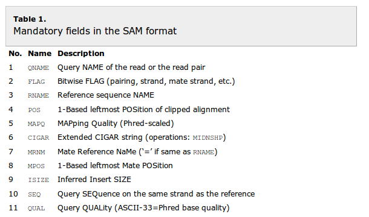

Approximate time:

## Learning objectives


### Alignment file format: SAM/BAM

The output we requested from STAR is a BAM file, and by default returns a file in SAM format. BAM is a binary version of the SAM file, also known as Sequence Alignment Map format. The SAM file is a tab-delimited text file that contains information for each individual read and its alignment to the genome. The file begins with a header, which is optional, followed by an alignment section.  If present, the header must be prior to the alignments and starts with '@'. Each line that follows corresponds to alignment information for a read. Each alignment line has **11 mandatory fields for essential mapping information** and a variable number of fields for aligner specific information.


**Need a more in-depth description of the SAM file format**

These fields are described briefly below, but for more detailed information the paper by [Heng Li et al](http://bioinformatics.oxfordjournals.org/content/25/16/2078.full) is a good start.




### `samtools`

Let's take a quick look at our alignment. To do so we first convert our BAM file into SAM format using samtools and then pipe it to the `less` command. This allows us to look at the contents without having to write it to file (since we don't need a SAM file for downstream analyses). We first need to load the samtools module:

	module load seq/samtools/1.2

```
$ samtools view -h results/STAR/Mov10_oe_1_Aligned.sortedByCoord.out.bam | less

```
 
Scroll through the SAM file and see how the fields correspond to what we expected.

****

**Exercise:**
On examining the SAM file

***

### Visualization

Index the BAM file for visualization with IGV:

    samtools index results/STAR/Mov10_oe_1__Aligned.sortedByCoord.out.bam

**Transfer files to your laptop using the command line**

We previously used FileZilla to transfer files from Orchestra to your laptop. However, there is another way to do so using the command line interface. _This option is only available for Mac and Linux users! PC users can use Filezilla._  Similar to the `cp` command to copy there is a command that allows you to securely copy files between computers. The command is called `scp` and allows files to be copied to, from, or between different hosts. It uses ssh for data transfer and provides the same authentication and same level of security as ssh. 

First, identify the location of the _origin file_ you intend to copy, followed by the _destination_ of that file. Since the origin file is located on Orchestra, this requires you to provide remote host and login information.

The following 2 files need to be moved from Orchestra to your local machine,
 
`results/STAR/Mov10_oe_1_Aligned.sortedByCoord.out.bam`,

`results/STAR/Mov10_oe_1_Aligned.sortedByCoord.out.bam.bai` 

```
$ scp user_name@orchestra.med.harvard.edu:/home/user_name/unix_oct2015/rnaseq_project/results/Mov10_oe_1_Aligned.sortedByCoord.out.bam* /path/to/directory_on_laptop
```


**Visualize**

* Start [IGV](https://www.broadinstitute.org/software/igv/download) _You should have this previously installed on your laptop_
* Load the Human genome (hg19) into IGV using the dropdown menu at the top left of your screen. _Note: there is also an option to "Load Genomes from File..." under the "Genomes" pull-down menu - this is useful when working with non-model organisms_
* Load the .bam file using the **"Load from File..."** option under the **"File"** pull-down menu. *IGV requires the .bai file to be in the same location as the .bam file that is loaded into IGV, but there is no direct use for that file.*


#### Exercise
Now that we have done this for one sample, let's try using the same commands to perform alignment on one of the control samples. Using `Irrel_kd_1_qualtrim25.minlen35.fq` walk through the alignment commands above. Copy over the resulting BAM and index file to your laptop and upload into IGV for visualization. 

1. How does the MOV10 gene look in the control sample in comparison to the overexpression sample?
2. Take a look at a few other genes by typing into the search bar. For example, PPM1J and PTPN22. How do these genes compare? 


---
*This lesson has been developed by members of the teaching team at the [Harvard Chan Bioinformatics Core (HBC)](http://bioinformatics.sph.harvard.edu/). These are open access materials distributed under the terms of the [Creative Commons Attribution license](https://creativecommons.org/licenses/by/4.0/) (CC BY 4.0), which permits unrestricted use, distribution, and reproduction in any medium, provided the original author and source are credited.*
