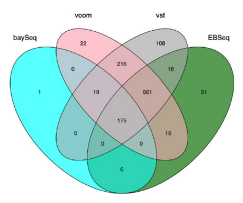

Approximate time: 

## Learning Objectives 

* 


## Differential expression analysis
Thus far, we have described different strategies for RNA-Seq data (i.e. de novo transcriptome assembly, transcript discovery) but arguably the most common use for transcriptome data is to to search for differentially expressed genes. Finding genes that are differentially expressed between conditions is an integral part of understanding the molecular basis of phenotypic variation [[Soneson and Dleorenzi, 2013](https://bmcbioinformatics.biomedcentral.com/articles/10.1186/1471-2105-14-91)].

There are a number of software packages that have been developed for differential expression analysis of RNA-seq data, and new methods are continuously being presented. Many studies describing comparisons between these methods show that while there is some agreement, there is also much variability. **Additionally, there is no one method that performs optimally under all conditions.**


 

 


In the next few lessons, we will walk you through an end-to-end gene-level RNA-seq differential expression workflow using various R packages. We will start with a count matrix and perform exploratory data analysis for quality assessment and to explore the relationship between samples, perform differential expression analysis, and visually explore the results.

## Setting up

Let's get started by opening up RStudio and setting up a new project for this analysis. 

1. Go to the `File` menu and select `New Project`.
2. In the `New Project` window, choose `New Directory`. Then, choose `Empty Project`. Name your new directory `DEanalysis` and then "Create the project as subdirectory of:" the Desktop (or location of your choice).
3. After your project is completed, it should automatically open in RStudio. 

To check whether or not you are in the correct working directory, use `getwd()`. The path `Destktop/DEanalysis` shoudl be returned to you in the console. Within your working directory use the `New folder` button in the bottom righ panel to create three new directories: `data`, `meta` and `results`. Remember the key to a good analysis is keeping organized from the start!

Go to the `File` menu and select `New File`, and select `R Script`. This should open up a script editor in the top left hand corner. This is where we will be typing and saving all commands required for this analysis. In the script editor type in a header line:

```
## Gene-level differential expression analysis using DESeq2
## NGS Data Analysis 2016
```

Now save the file as `de_script.R`. When finished your working directory should now look something like this:


Finally, we need to grab the files that we will be working with for the analysis. For each of the files below we have provided a link. Right click on the link, and "Save link as ...". The counts data will need to be put inside the `data` directory, and the metadata file in your `meta` directory.

* 


## DESeq2

Amongst the methods that work on count data directly, a popular tool is [DESeq2](https://bioconductor.org/packages/release/bioc/html/DESeq2.html). The methodology of DESeq2 (as described in the lecture), has high sensitivity and precision, while controlling the false positive rate. DESeq2 is available as an R/Bioconductor package   


---
*This lesson has been developed by members of the teaching team at the [Harvard Chan Bioinformatics Core (HBC)](http://bioinformatics.sph.harvard.edu/). These are open access materials distributed under the terms of the [Creative Commons Attribution license](https://creativecommons.org/licenses/by/4.0/) (CC BY 4.0), which permits unrestricted use, distribution, and reproduction in any medium, provided the original author and source are credited.*