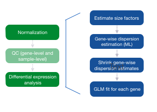

Approximate time: 

## Learning Objectives 

* 


## DESeq2: Differential expression analysis

### Getting setup

Let's get started by opening of RStudio and opening up the project that we created yesterday. 

1. Go to the File menu and select 'Open project ...'
2. Navigate to `~/Desktop/DEanalysis/` and double click on the `DEanalysis.Rproj` file

You should see your environment now populated with all of the variables created last lesson. The only thing that we will need to do is re-load the required libraries:

```
library(ggplot2)
library(RColorBrewer)
library(DESeq2)
library(pheatmap)
```


### Running DESeq2

To run the differential expression pipeline on the raw counts in DESeq2 we can do this with a **single call to the function `DESeq()`**. The required input is the `DESeqDataSet` object that we created in the last lesson. By re-assigning the results of the function back to the same variable name, we can continue to fill in the `slots` in our `DESeqDataSet` object.

	##Run analysis
	dds <- DESeq(dds)
 
This function will print out a message for the various steps it performs. 

```
estimating size factors
estimating dispersions
gene-wise dispersion estimates
mean-dispersion relationship
final dispersion estimates
fitting model and testing
``` 

What just happened? Remember our workflow:




Everything from normalization to linear modeling was carried out by the use of a single function! The results of each step were inserted into the object that you initialized.


But wait, you may be asking yourself shouldn't the QC assessment have been performed post-normalization? The answer is, yes it was.

When you ran the `rlog()` function the normalization was performed. And so if we compare the `sizeFactors` value in both objects you will find that the values are identical.

	sizeFactors(dds)
	rld$sizeFactors

> *NOTE:* The two objects require different ways in which we can access the information stored inside. When in doubt, use `class()` to find out what type of data structure you are working with. Knowing this information is key to finding ways of extracting infomration from the object.


---
*This lesson has been developed by members of the teaching team at the [Harvard Chan Bioinformatics Core (HBC)](http://bioinformatics.sph.harvard.edu/). These are open access materials distributed under the terms of the [Creative Commons Attribution license](https://creativecommons.org/licenses/by/4.0/) (CC BY 4.0), which permits unrestricted use, distribution, and reproduction in any medium, provided the original author and source are credited.*