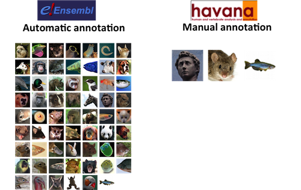
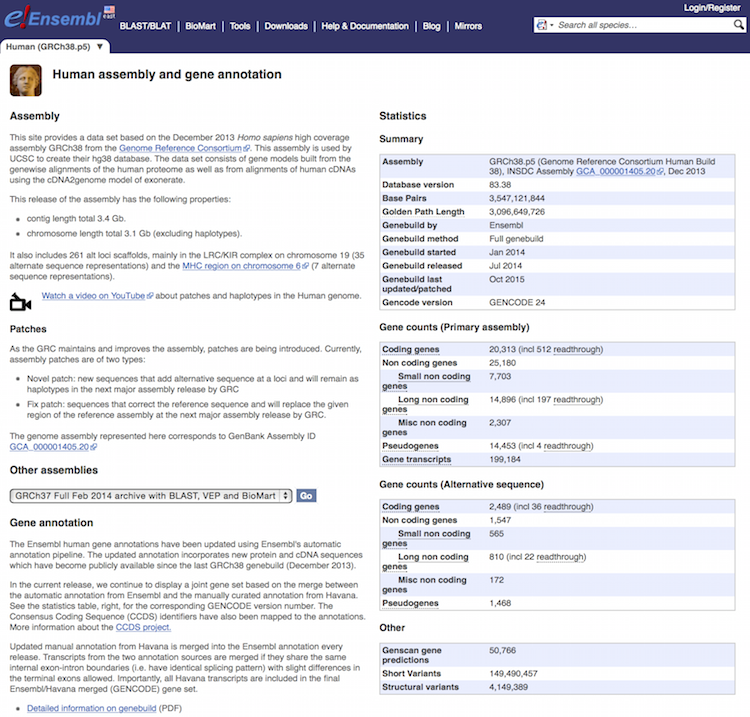
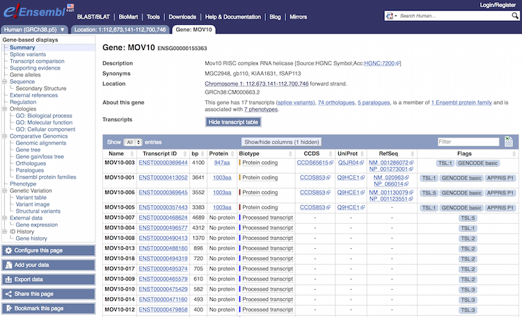
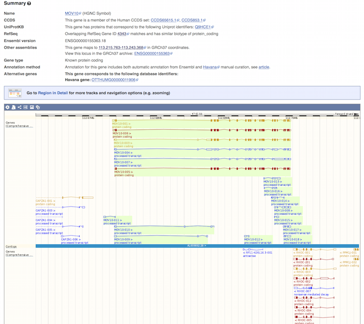

Contributors: Mary Piper

Approximate time: 3 hours

## Learning Objectives

* learn how to use features of the Ensembl biological database and genome browser to access information and data during an NGS analysis

## Intro to Ensembl/Biomart

### The Ensembl Project

The [Ensembl](http://useast.ensembl.org/index.html) genome annotation system, developed jointly by the EBI and the Wellcome Trust Sanger Institute, has been used for the annotation, analysis and display of vertebrate genomes since 2000. All data are open source, i.e. freely available to the scientific community and are updated every 2-3 months.

Since 2009, the Ensembl site has been complemented by the [Ensembl genomes](http://ensemblgenomes.org) sites for [bacteria](http://ensemblgenomes.org/info/genomes?division=1), [protists](http://ensemblgenomes.org/info/genomes?division=5), [fungi](http://ensemblgenomes.org/info/genomes?division=3), [plants](http://ensemblgenomes.org/info/genomes?division=4) and [invertebrate metazoa](http://ensemblgenomes.org/info/genomes?division=2), enabling users to use a single collection of interfaces for accessing and comparing genome-scale data from species across the taxonomy. _**NOTE:** no annotations available through Ensembl for viral genomes._

### Ensembl species and annotations
In the current release of Ensembl (83), over 80 vertebrate species are supported, with over half of these species being mammals. The dataset also includes the invertebrates yeast, *C. elegans*, and fruitfly to aid in more accurate generation of phylogenetic gene trees. *(Current species statistics for the  non-vertebrate databases are also [available](http://nar.oxfordjournals.org/content/44/D1/D574.full)).*

**All supported species have comprehensive, evidence-based gene annotations.** The "Gencode gene set" is used to create the Ensembl annotations and is made up of:

- Ensembl (automatically) annotated genes (using mRNA and protein sequences from UniProtKB and NCBI RefSeq) 
- Havana (manually) annotated genes
- Ensembl/Havana merges: transcripts that were identically annotated by both (reviewed annotations)

Gencode is the default gene set used by ENCODE, 1000 genomes and other major projects. 

A **selected set of genomes** includes additional data focused on *variation, comparative, evolutionary, functional and regulatory annotation*. The most advanced resources are provided for key species including **human, mouse, rat and zebrafish** reflecting the popularity and importance of these species in biomedical research.

### Ensembl genome browser

#### Overview
Ensembl provides a genome browser that acts as a **single point of access to annotated genomes** for vertebrate species. 

The browser can be used to easily access information at the genome, gene and protein level, such as gene sequence, splice variants, protein domains, genetic variation, homology, and regulatory elements. Ensembl imports genome sequences from consortia, which keeps the information consistent with many other bioinformatics projects. 

- **Searching Ensembl**:  Look for a gene, location, variant and more using the search box on the homepage or the box that is provided in the top right corner of any Ensembl page.

	- a gene name (for example, BRCA2) - best to use the official gene symbols ([HGNC](http://www.genenames.org))
	- a UniProt accession number (for example, P51587)
	- a disease name (for example, coronary heart disease)
	- a variation (for example, rs1223)
	- a location - a genomic region (for example, rat X:100000..200000)
	- a PDBe ID or a Gene Ontology (GO) term

	Most search results will take you to the appropriate Ensembl view through a results page. If you search using a location you will be directed straight to the location tab (this tab provides a view of a region of a genome).

- **Browse a Genome**: Choose your species of interest in this section. The drop down menu under 'All genomes' allows you to select from the full list. The *Ensembl Pre!* site contains new genomes (either new species to Ensembl, or updates in the reference assembly) that do not yet have an Ensembl gene set.  BLAST/BLAT is available for organisms in all Ensembl sites, including Pre!

- **Help**: There is a wealth of help and documentation in Ensembl if you are new to the browser. Video tutorials are provided, and printable pdfs with exercises. Custom data may be uploaded to Ensembl, or displayed directly by attaching a file by URL. 

- **News**: To find out what release you are working with, have a look at the news section of the homepage. If the current release is not the one you need, access archive sites to access previous versions, or releases, of Ensembl using the link on the lower right side.

- **FTP site**: If you are looking to download the sequence for the reference genome or the gene annotation file for your organism of interest, the link is not accessible from this page, but you can find it at: http://useast.ensembl.org/info/data/ftp/index.html.
 
#### Demo
Each species in Ensembl has its own home page, where you can find out who provided the genome sequence and which version of the genome assembly is represented.  

1. Click on `View full list of all Ensembl species` link. 
2. Click on the common name of your species of interest to go to the species homepage. We’ll click on `Human`.

	

	Within the human genome page, find the basic features:

	- Search bar for human information on gene, location, disease, etc.
	- News for the current human genome release
	- Information and sequences for the current human genome build
	- Links to example features in Ensembl
	- Guides on how to access information on comparative genomics, regulation, and variation
	
3. To find out more about genome assembly and the gene build, click on `More information and statistics`. Look over the information given in the statistics table.

	

4. Go back to the human genome page by clicking on the image. In the search bar type `mov10`.
5. From the search results select `MOV10 (Human Gene)`. The gene page for MOV10 should populate. 
	
	
	
	The `Gene` page is organized as follows:
	
	- The top of the page has a **gene overview**, giving a gene description, synonyms, location, and number of transcripts. In addition, there are links to comparative analysis data and associated protein families and phenotypes.	
	- The overview is followed by the **transcript table**. All transcripts identified using any evidence are provided in the table. The transcripts are color-coded based on whether the transcript is protein-coding or non-coding, as well as, by the quality of evidence:
	
		- **Gold:** protein-coding transcripts are Ensembl/Havana merges - essentially reviewed annotations with highest confidence
		- **Red:** protein-coding transcripts are less confidence
		- **Blue:** non-coding transcripts
		
		In addition to coloring, Ensembl also provides flags in the table for **"Transcript Support Levels"**, which highlight how well-supported or poorly-supported are the transcript models.
		
		Also provided in the table are the links to the **Consensus CoDing Sequence** sets (CCDS) for available transcripts. The CCDS is a consensus set of coding sequences established as a collaborative effort between NCBI, Ensembl, Vega, UniProt-SwissProt, and UCSC. 
		
		Note the Ensembl ID for MOV10 gene: ENSG00000155363. Ensembl uses the following format for naming:
	
		- ENSG###########	Ensembl Gene ID
		- ENST###########	Ensembl Transcript ID
		- ENSP###########	Ensembl Peptide ID
		- ENSE###########	Ensembl Exon ID
	
		For non-human species a suffix is added:
	
		- MUS (Mus musculus) for mouse ENSMUSG###
		- DAR (Danio rerio) for zebrafish: ENSDARG###
	

	- Below the transcript table is a summary section with links to external databases, followed by visualization of the transcripts.
	
	
	
	**NOTE:**, in the visualization, the blue bar represents the genome contig, and transcripts above the bar are forward-stranded and those below are reverse.
	
	- The side panel has **detailed gene information** displayed as a hierarchical tree. The various categories provide detailed and downloadable gene information, including associated sequence data, regulatory regions, GO terms, comparative genomics information, and variation data.
	
6. Let's suppose we are interested in the MOV10-001 transcript. Click on the MOV10-001 transcript ID, `ENST00000413052`. This should open a new tab entitled `Transcript: MOV10-001` with detailed information for the transcript. 

	- If you click on `exons`, the sequence for each of the exons will be displayed below. If you click on `12 domains and features` the associated domains are output. If you click on `625 variations`, all variants for the transcript are listed with variation IDs, supporting evidence, and predicted effect on protein function. Additional detailed information on the transcript and protein is available on the side panel. 

7. Let's now visualize our our transcripts for the gene using the `Location` tab. There are three separate parts to this window:
	- The chromosome with haplotypes and patches flagged within the image. Selecting a region of the chromosome can move you to a new location.
	- The "Region in detail", which shows a 1Mb region around the selected location on the chromosome. Choosing a different location within this region is also an option.
	- The bottom image is a detailed, configurable view of the region. You can configure the tracks that appear using the cog on the window bar or you can click on "Configure this page" button on the side of the page.
	
	Let's click on `Configure this page` and add some tracks:

	- `dbSNP variants`
	- `RNASeq models - all brain`

Click the checkmark in the upper right-hand corner of the page when finished with the selections.

	
## BioMart

***
*This lesson has been developed by members of the teaching team at the [Harvard Chan Bioinformatics Core (HBC)](http://bioinformatics.sph.harvard.edu/). These are open access materials distributed under the terms of the [Creative Commons Attribution license](https://creativecommons.org/licenses/by/4.0/) (CC BY 4.0), which permits unrestricted use, distribution, and reproduction in any medium, provided the original author and source are credited.*
* _The materials used in this lesson were derived from work that is Copyright © [Ensembl](http://www.ebi.ac.uk/seqdb/confluence/display/ENSEXT/Ensembl+exercises). All Ensembl instructional material is made available under the [Creative Commons Attribution license](https://creativecommons.org/licenses/by/4.0/) (CC BY 4.0). Special thanks to Giulietta Spudich for providing training materials!_
