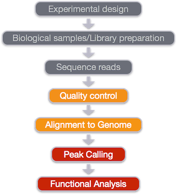

Contributors: Mary Piper, Radhika Khetani

Approximate time: 1 hour

## Learning Objectives

* to use previous knowledge of quality control steps to perform FastQC and trimming
* to understand parameters and perform alignment using Bowtie2

# ChIP-Seq analysis 

Now that we have our files and directory structure, we are ready to begin our ChIP-Seq analysis. 



## Quality Control
For any NGS analysis method, our first step is ensuring our reads are of good quality prior to aligning them to the reference genome. We will use FastQC to get a good idea of the overall quality of our data, to identify whether any samples appear to be outliers, to examine our data for contamination, and to determine a trimming strategy.

Let's run FastQC on all of our files. 

Start an interactive session if you are not already in one and change directories to the untrimmed_fastq folder.

```
$ cd ~/ngs_course/chipseq/data/untrimmed_fastq 

$ module load seq/fastqc/0.11.3 

$ fastqc H1hesc_Input_Rep1_chr12.fastq 
```

Now, move all of the `fastqc` files to the `results/untrimmed_fastqc` directory:

`$ mv *fastqc* ../../results/untrimmed_fastqc/`

Transfer the FastQC zip file for Input replicate 1 to your local machine using FileZilla and view the report.


Based on the sequence quality plot, trimming should be performed from both ends of the sequences. We will create a Trimmomatic script to trim the reads from both ends of the sequence.

Remember that *Trimmomatic* has a variety of options and parameters:

* **_SE_** or **_PE_** Single End or Paired End reads?
* **_-threads_** How many processors do you want *Trimmomatic* to run with?  
* **_-phred33_** or **_-phred64_** Which quality score do your reads have?
* **_SLIDINGWINDOW_** Perform sliding window trimming, cutting once the average quality within the window falls below a threshold.
* **_LEADING_** Cut bases off the start of a read, if below a threshold quality.
* **_TRAILING_** Cut bases off the end of a read, if below a threshold quality.
* **_CROP_** Cut the read to a specified length.
* **_HEADCROP_** Cut the specified number of bases from the start of the read.
* **_MINLEN_** Drop an entire read if it is below a specified length.
* **_ILLUMINACLIP_** Cut adapter and other illumina-specific sequences from the read
* **_TOPHRED33_** Convert quality scores to Phred-33.
* **_TOPHRED64_** Convert quality scores to Phred-64.

Since we are only trimming a single file, we will run the command in the interactive session rather than creating a script:

```
$ java -jar /opt/Trimmomatic-0.33/trimmomatic-0.33.jar SE \
-threads 4 \
-phred33 \
H1hesc_Input_Rep1_chr12.fastq \
../trimmed_fastq/H1hesc_Input_Rep1_chr12.qualtrim20.minlen36.fq \
LEADING:20 \
TRAILING:20 \
MINLEN:36
```

Let's see how much trimming improved our reads by running FastQC again:

`$ fastqc ../trimmed_fastq/H1hesc_Input_Rep1_chr12.qualtrim20.minlen36.fq`


## Alignment


***
*This lesson has been developed by members of the teaching team at the [Harvard Chan Bioinformatics Core (HBC)](http://bioinformatics.sph.harvard.edu/). These are open access materials distributed under the terms of the [Creative Commons Attribution license](https://creativecommons.org/licenses/by/4.0/) (CC BY 4.0), which permits unrestricted use, distribution, and reproduction in any medium, provided the original author and source are credited.*

