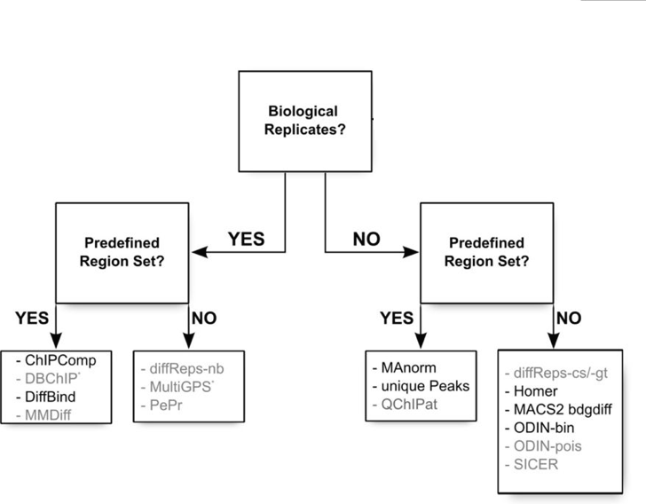

Contributors: Meeta Mistry, 

Approximate time: 90 minutes

## Learning Objectives

* Learning how to use MACS2 to compare peaks between two sample groups


## Differential binding 

Increasing number of ChIP-seq experiments are investigating transcription factor binding under multiple experimental conditions, for example, various treatment conditions, several distinct time points and different treatment dosage levels. Hence, identifying differential binding sites across multiple conditions is of practical importance in biological and medical research. 

There are various methods/tools available when investigating narrow peaks, and the choice of tool will depend heavily on your experimental design. 



In our case, we are interested in identifying differences in binding between two transcription factors. For each group we have two replicates, and it would be best to use tools that make use of these replicates (i.e [DiffBind](http://bioconductor.org/packages/release/bioc/html/DiffBind.html), [ChIPComp](https://www.bioconductor.org/packages/3.3/bioc/html/ChIPComp.html)) to compute statistics reflecting how significant the changes are. 

However, in the interest of time we are going to explore tools that we have already become familiar with in this lesson. First, we will use `bedtools` which we have already had some experience with. Second, **MACS2 has a sub-command named `bdgdiff`** which can be useful for differential peak detection in the case when you don't have replicates.

## Using `bedtools` to compare peaks
As a first pass we will take a look at the overlapping peaks using the merged peak calls we have already generated.

### Setting up

Login to Orchestra and start up an interactive session:

	$ bsub -Is -q interactive bash

Navigate to the `results` directory we have been working in:

	$ cd ~/ngs_course/chipseq/results
	
Make a directory for the ouput generated from `bedtoools`:

	$ mkdir TFcompare
	$ cd TFcompare
	
Load the `bedtools` module:

	$ module load seq/BEDtools/2.23.0

We will only look at the peak calls generated from MACS2, so let's copy over the merged peaks file we had already generated:

	$ cp ../overlap_spp_macs2/macs2_Nanog_merged.bed .
	
Create a merged file for the Pou5f1 replicates by first combining and sorting the data:

	# Concatenate files
	$ cat ../macs2/Pou5f1-rep1_peaks.narrowPeak ../macs2/Pou5f1-rep2_peaks.narrowPeak > macs2_Pou5f1.narrowPeak
	
	# Sort file
	$ sort -k1,1 -k2,2n macs2_Pou5f1.narrowPeak > macs2_Pou5f1_sorted.narrowPeak
	
	# Merge peaks
	$ bedtools merge -i macs2_Pou5f1_sorted.narrowPeak > macs2_Pou5f1_merged.bed 

Now that we have two merged peak files we can use them as input for a `bedtools intersect`:

	$ bedtools intersect -a macs2_Nanog_merged.bed -b macs2_Pou5f1_merged.bed -wo > diffbind_macs.bed

*How many peaks are overlapping between Nanog and Pou5f1?*

We can add the `-v` parameter (in place of `-wo`)  to output peaks that are unique to Nanog:

	$ bedtools intersect -a macs2_Nanog_merged.bed -b macs2_Pou5f1_merged.bed -v > Nanog_unique_macs.bed

To find the unique peaks for Pou5f1 we need to reverse the input for `-a` and `-b` so that Pou5f1 is our file A:

	$ bedtools intersect -a macs2_Pou5f1_merged.bed -b macs2_Nanog_merged.bed -v > Pou5f1_unique_macs.bed

## `bdgdiff` to compare peaks

This sub-command takes as input the bedgraph files that were generated as part of our peak calling. Differential peak detection is performed based on paired four bedgraph files: 

* `--t1`: MACS pileup bedGraph for condition 1 (Nanog)
* `--t2`: MACS pileup bedGraph for condition 2 (Pou5f1)
* `--c1`: MACS control lambda bedGraph for condition 1 (Nanog)
* `--c2`: MACS control lambda bedGraph for condition 2 (Pou5f1)

There are a few other parameters pertaining to the output files that we also need to specify:

* `--outdir`: the output directory
* `-o`: names for the output files 

Other parameters that can be changed (but we will leave as defaults) include:

* `-C`: logLR cutoff (default 3; likelihood ratio=1000)
* `-l`: Minimum length of differential region. Try bigger value to remove small regions (default 200)
* `-g`: Maximum gap to merge nearby differential regions. Consider a wider gap for broad marks. (default 100)
* `--d1, --d2`: Sequencing depth (# of non-redundant reads in million) for each sample

### Setting up 
	
Make a directory for the ouput generated from `bdgdiff`:

	$ mkdir macs2bdgdiff
	
And finally, we will need to load the MACS2 module in order to use the sub-command:

	$ module load seq/macs/2.1.0
	
We are now ready to run the `bdgdiff` command:

```
macs2 bdgdiff --t1 macs2/Nanog-rep1_treat_pileup.bdg \
--t2 macs2/Pou5f1-rep1_treat_pileup.bdg \
--c1 macs2/Nanog-rep1_control_lambda.bdg \
--c2 macs2/Pou5f1-rep1_control_lambda.bdg \
--outdir macs2bdgdiff \
-o unique_Nanog_rep1.bed unique_Pou5f1_rep1.bed Nanog_Pou5f1_rep1common.bed 
``` 

Take a look at the output directory `macs2bdgdiff`, 

	$ ls -l macs2bdgdiff

You should see three files have been generated:

1. One for unique regions in Nanog
2. One for unique regions in Pou5f1
3. One for common regions between the two

Count the lines in each to see how many regions overlap between the two transcription factors:

	$ wc -l macs2bdgdiff/*
	
Run the `bgdiff` command on the second replicates of each transcription factor:

```
macs2 bdgdiff --t1 macs2/Nanog-rep2_treat_pileup.bdg \
--t2 macs2/Pou5f1-rep2_treat_pileup.bdg \
--c1 macs2/Nanog-rep2_control_lambda.bdg \
--c2 macs2/Pou5f1-rep2_control_lambda.bdg \
--outdir macs2bdgdiff \
-o unique_Nanog_rep2.bed unique_Pou5f1_rep2.bed Nanog_Pou5f1_rep2common.bed
```	
*How do the number of overlapping regions compare for the two replicates?*

***
*This lesson has been developed by members of the teaching team at the [Harvard Chan Bioinformatics Core (HBC)](http://bioinformatics.sph.harvard.edu/). These are open access materials distributed under the terms of the [Creative Commons Attribution license](https://creativecommons.org/licenses/by/4.0/) (CC BY 4.0), which permits unrestricted use, distribution, and reproduction in any medium, provided the original author and source are credited.*


