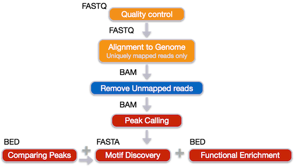

Contributors: Mary Piper

Approximate time: 1 hour

## Learning Objectives

* to explore web-based tools for motif discovery and functional analysis of the peak calls

# Motif disovery and functional analysis



We have identified regions of the genome where the number of reads aligning to these areas differ significantly between our Nanog IP samples and the input controls. These enriched regions represent the likely locations of where Nanog binds to the genome. 

After identifying likely binding sites, generally downstream analyses will often include: 

1. determining the binding motifs for the protein of interest
2. identifying which genes are associated with the binding sites

We will explore a few useful web-based tools for performing these analyses using our Nanog peak calls.

Since the motif and functional enrichment analyses are unlikely to give reliable results using only the 32.8 Mb of reads mapping to chr12. To obtain more signal, we will use the complete set of Nanog peak calls generated by ENCODE and **look at binding sites for the *whole* of chr12**. 

## Set-up

Copy over the ENCODE peak calls for Nanog, which contains the peak calls for the whole genome:

```
$ cd ~/ngs_course/chipseq/results

$ mkdir functional_analysis

$ cp -r /groups/hbctraining/ngs-data-analysis2016/chipseq/other/ENCODE_peak_calls .

$ cd ENCODE_peak_calls 
```